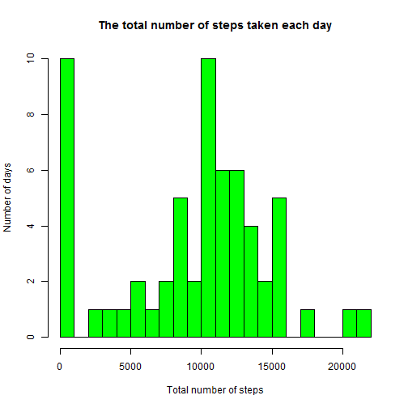
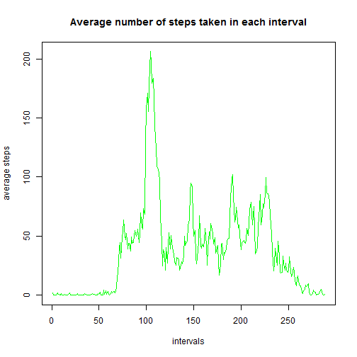
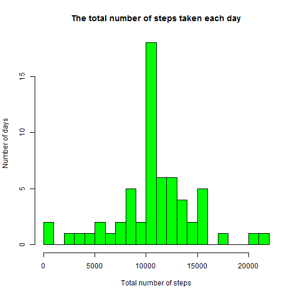
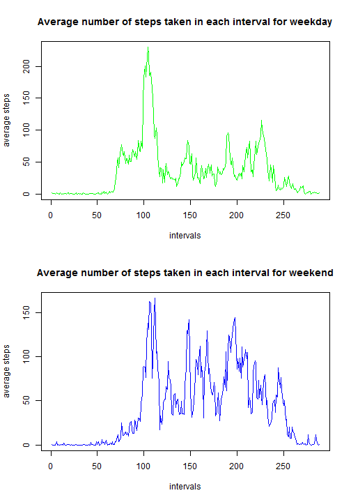

This is an R Markdown document for Project 1 of course Reproducible Research.

## 1. Loading and preprocessing the data
#### 1.1 Load the data

```r
data <- read.csv("activity.csv", header = TRUE)
```

#### 1.2. Process/transform the data (if necessary) into a format suitable analysis
First, we need to test the type of data for steps, date and interval. 

```r
class(data$steps)
```

```
## [1] "integer"
```

```r
class(data$date)
```

```
## [1] "factor"
```

```r
class(data$interval)
```

```
## [1] "integer"
```
Apparently, the data type for date is not correct. But for now we do not need to change anything as we will deal with NA value and change data type later in Part 5.

For interval, it should not be integer as it helps us identify each 5-minute interval. Thus it should have a data type of factor. 

```r
data$interval <- as.factor(data$interval)
```


## 2. What is mean total number of steps taken per day?
#### 2.1 Calculate the total number of steps taken per day

```r
tapply(data$steps, data$date, sum, na.rm = TRUE)
```

```
## 2012-10-01 2012-10-02 2012-10-03 2012-10-04 2012-10-05 2012-10-06 
##          0        126      11352      12116      13294      15420 
## 2012-10-07 2012-10-08 2012-10-09 2012-10-10 2012-10-11 2012-10-12 
##      11015          0      12811       9900      10304      17382 
## 2012-10-13 2012-10-14 2012-10-15 2012-10-16 2012-10-17 2012-10-18 
##      12426      15098      10139      15084      13452      10056 
## 2012-10-19 2012-10-20 2012-10-21 2012-10-22 2012-10-23 2012-10-24 
##      11829      10395       8821      13460       8918       8355 
## 2012-10-25 2012-10-26 2012-10-27 2012-10-28 2012-10-29 2012-10-30 
##       2492       6778      10119      11458       5018       9819 
## 2012-10-31 2012-11-01 2012-11-02 2012-11-03 2012-11-04 2012-11-05 
##      15414          0      10600      10571          0      10439 
## 2012-11-06 2012-11-07 2012-11-08 2012-11-09 2012-11-10 2012-11-11 
##       8334      12883       3219          0          0      12608 
## 2012-11-12 2012-11-13 2012-11-14 2012-11-15 2012-11-16 2012-11-17 
##      10765       7336          0         41       5441      14339 
## 2012-11-18 2012-11-19 2012-11-20 2012-11-21 2012-11-22 2012-11-23 
##      15110       8841       4472      12787      20427      21194 
## 2012-11-24 2012-11-25 2012-11-26 2012-11-27 2012-11-28 2012-11-29 
##      14478      11834      11162      13646      10183       7047 
## 2012-11-30 
##          0
```

#### 2.2 Histogram

```r
hist_data <- tapply(data$steps, data$date, sum, na.rm = TRUE)
hist(hist_data, breaks = 19, col = "green", xlab = "Total number of steps", ylab = "Number of days", main = "The total number of steps taken each day")
```

 

#### 2.3 The mean and median of the total number of steps taken per day

```r
mean(hist_data)
```

```
## [1] 9354.23
```

```r
median(hist_data)
```

```
## [1] 10395
```

## 3. What is the average daily activity pattern?
#### 3.1. Make a time series plot

```r
time_data <- tapply(data$steps, data$interval, mean, na.rm = TRUE)
plot(time_data, type = "l", xlab = "intervals", ylab = "average steps", main ="Average number of steps taken in each interval", col = "green")
```

 

#### 3.2. Which 5-minute interval contains the maximum number of steps?

```r
for (i in 1:length(time_data)) {
  if (time_data[i] == max(time_data)) {
    print(time_data[i])
  }
}
```

```
##      835 
## 206.1698
```

The 5-minute interval labeled as "835" (which refers to 8:35), on average across all the days in the dataset, contains the maximum number of steps, which is 206.1698.

## 4. Imputing missing values
#### 4.1. Total number of missing values

```r
sum(is.na(data$steps))
```

```
## [1] 2304
```
There are 2304 missing values.

#### 4.2. Strategy
My decision is to populate the NA rows with the mean for that 5-minute interval.

#### 4.3. New table

```r
new_data <- data
for (i in 1:length(new_data$steps)) {
  if (is.na(new_data$steps[i])) {
    average <- mean(new_data$steps[new_data$interval == new_data$interval[i]], na.rm = TRUE)
    new_data$steps[i] <- average
  }
}
```

#### 4.4 New histogram

```r
new_hist_data <- tapply(new_data$steps, new_data$date, sum)
hist(new_hist_data, breaks = 19, col = "green", xlab = "Total number of steps", ylab = "Number of days", main = "The total number of steps taken each day")
```

 

```r
mean(new_hist_data)
```

```
## [1] 10766.19
```

```r
median(new_hist_data)
```

```
## [1] 10766.19
```

These values differ from the estimates from the first part of the assignment. Imputing missing data increased the estimates of the total daily number of steps. The mean and median both increased and they are the same.

## 5. Are there differences in activity patterns between weekdays and weekends?
#### 5.1 New factor variable

```r
new_data$date <- as.POSIXlt(as.character(new_data$date), format="%Y-%m-%d")
library(timeDate)
new_data$day = NA
for (i in 1:length(new_data$date)) {
  if (isWeekday(new_data$date[i])) {
    new_data$day[i] <- "Weekday"
  }
  else {
    new_data$day[i] <- "Weekend"
  }
}
new_data$day <- as.factor(new_data$day)
```

#### 5.2 Plotting

```r
par(mfrow=c(2,1))
weekday_time_data <- tapply(new_data$steps[new_data$day == "Weekday"], data$interval[new_data$day == "Weekday"], mean)
plot(weekday_time_data, type = "l", xlab = "intervals", ylab = "average steps", main ="Average number of steps taken in each interval for weekday", col = "green")

weekend_time_data <- tapply(new_data$steps[new_data$day == "Weekend"], data$interval[new_data$day == "Weekend"], mean)
plot(weekend_time_data, type = "l", xlab = "intervals", ylab = "average steps", main ="Average number of steps taken in each interval for weekend", col = "blue")
```

 

